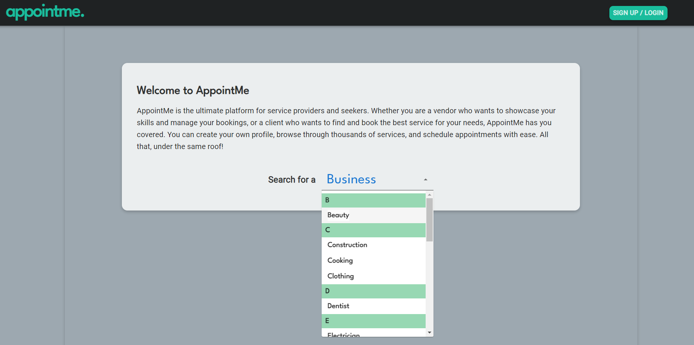
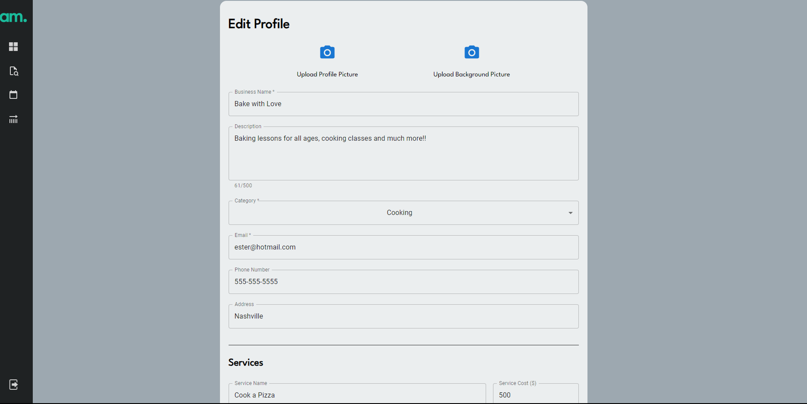
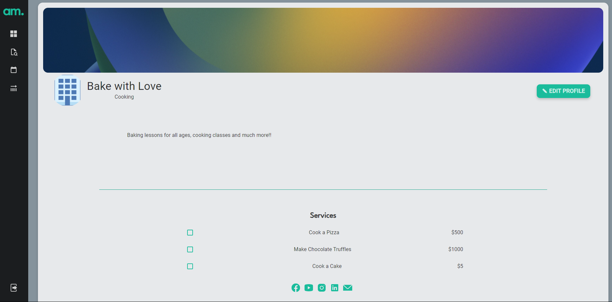
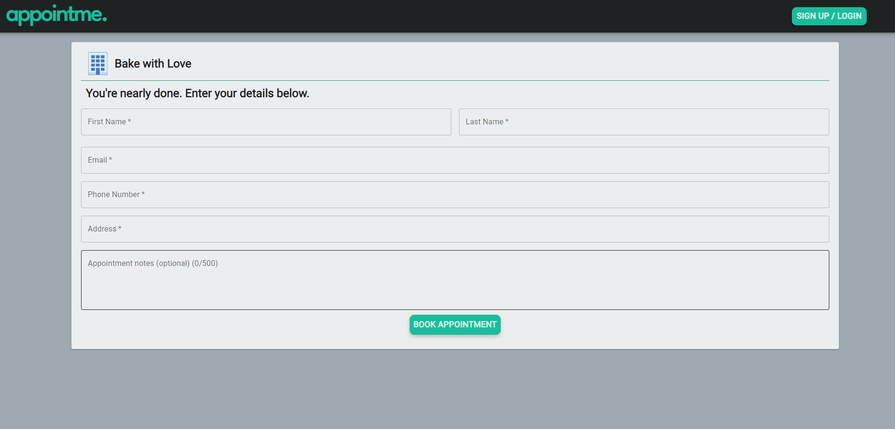

# AppointMe

CRM for freelancers and booking service

## Table of Contents

- [Description](#description)
- [User Story](#user-story)
- [Acceptance Criteria](#acceptance-criteria)
- [Installation](#installation)
- [Usage](#usage)
- [License](#license)
- [Contributing](#contributing)
- [Questions](#questions)

### Description

AppointMe is a platform for service providers and seekers. It targets freelancers who have their own business but don't have a website, and it gives them the chance to create a business profile, track their clients and their schedule, as well as get directly booked through the platform by people looking for their services.

- Landing page. Browse through the different industries to find the Vendor you'd like to book your appointment with.



- Edit Profile for vendors.



- Vendor Profile view.



- Book Appointment view.



- Follow the link to access the live version of AppointMe: `add link`

- GitHub repository: `https://github.com/EFP18/AppointMe`

## User Story

```
AS A freelancer/business owner/service provider
I WANT to have an appointment management system
SO THAT I can manage my clients, appointments and work schedule
```

## Acceptance Criteria

```
GIVEN a CRM site
WHEN I search for a business on the landing page
THEN I am presented with a searchbox/dropdown menu for available services
WHEN I click on the service that I want
THEN I am presented with the vendors/freelancers/businesses available
WHEN I click on the vendors/freelancers/businesses
THEN I am presented with the vendor's profile with their offered services
WHEN I choose a service and click continue
THEN I am presented with a calendar to pick a date and time to schedule my appointment
WHEN I choose a date and time
THEN I can enter my information for the appointment
WHEN I click on "Book Appointment"
THEN I am presented with an appointment confirmation message
```

### Installation

Follow the steps below to install the application:

- Clone the repository in your local machine.
- Navigate to the cloned repository locally.
- Run `npm i` to install all necessary dependencies.
- Run `npm run seed` to populate the seeded categories.
- Run `npm run develop` to start the application.

Once your repository is compiled successfully, the website will load automatically on your browser.

This application is deployed using `Heroku`.

### Usage

This project is a `MERN` stack single-page application, that uses `React` for the front end. Additionally, it uses the following technologies:

- `GraphQL API`, `Node.js`, and `Express.js` server.
- The application uses `queries` and `mutations` for retrieving, adding, updating, and deleting data.
- `MongoDB` and `Mongoose ODM` for the database.
- `JWT` authentication.
- Component library: `Material UI`.

### License

[](https://opensource.org/licenses/MIT)

### Contributing

- Drew Smith: `https://github.com/ds055`
- Thanh Doan: `https://github.com/teddysm`
- Ester Pelosof: `https://github.com/EFP18`
- Hunter Tran: `https://github.com/ShimmyShong`
- Daniel Mascali: `https://github.com/TurboTeam335`

### Questions

- GitHub: `https://github.com/EFP18/AppointMe`
- Email: `info@appointme.com`
