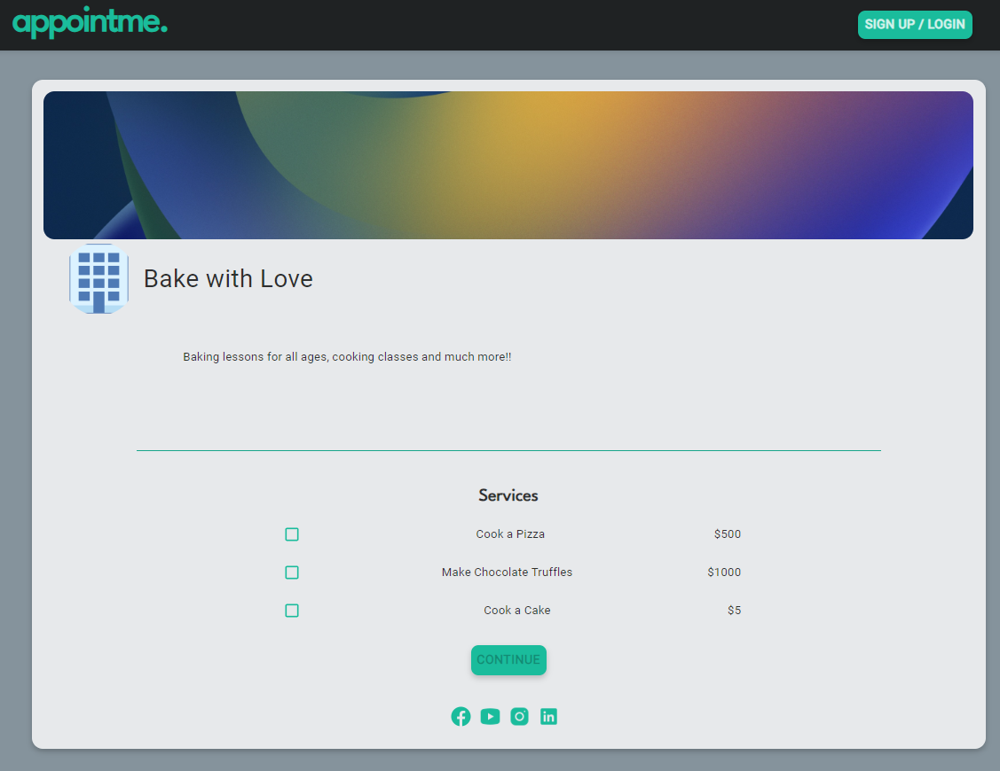

# AppointMe

CRM for freelancers and booking service

https://opensource.org/licenses/MIT

## Table of Contents

- [Description](#description)
- [Installation](#installation)
- [Usage](#usage)
- [License](#license)
- [Contributing](#contributing)
- [Questions](#questions)

### Description

AppointMe is a platform for service providers and seekers. It targets freelancers who have their own business but don't have a website, and it gives them the chance to create a business profile, track their clients and their schedule, as well as get directly booked through the platform by people looking for their services.

- Follow the link to access the live version of AppointMe: `add link`

- GitHub repository: `https://github.com/EFP18/AppointMe`

  ### Installation

  Follow the steps below to install the application:

- Clone the repository in your local machine.
- Navigate to the cloned repository locally.
- Run `npm i` to install all necessary dependencies.
- Run `npm run seed` to populate the seeded categories.
- Run `npm run develop` to start the application.

  Once your repository is compiled successfully, the website will load automatically on your browser. 

  This application is deployed using `Heroku`.

  ### Usage

  usage

  ### License

  MIT

  ### Contributing

  contibution?

  ### Questions

  - GitHub: `https://github.com/EFP18/AppointMe`
  - Email: `info@appointme.com`

TODO:

1. book an appointment button adds client appointment to db --> Ted !!!!!!!!!!!!
2. client notes modal --> Drew 
3. month view calendar can't open the event 2nd time --> Ted
6. add services!!!!!!! team work!!
7. upload images --> Hunter
8. readme --> team work
9. presentation : https://docs.google.com/presentation/d/1eKiCMBW5lZgPrqKxn2AehO71AmGxK-dtk1qi69G2_JU/edit#slide=id.p --> team work
10. responsive --> Daniel
13. description space for services remove?
14. calendar can't view on month
15. load error in landing page